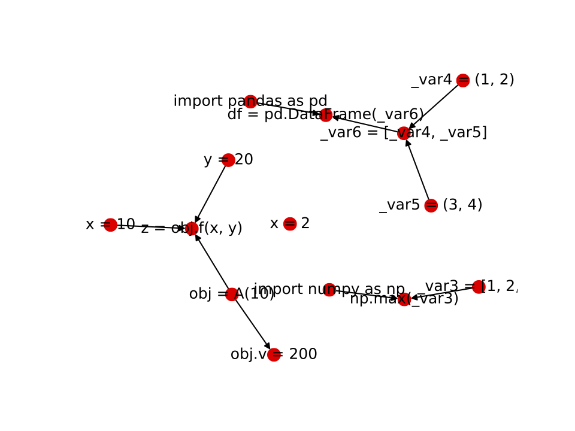

An attempt to avoid rewriting code I use often for PL analysis stuff.

# Installation
`pip install -e .`

# Usage Example


A simple example to collect a dynamic trace for a small program

```
$ cat src.py
import numpy as np
class A(object):
    def __init__(self, x):
        self.v = x

    def f(self, x, y):
        return x + y + self.v
x = 10
y = 20
obj = A(10)
z = obj.f(x, y)
obj.v = 200
np.max([1,2,3])
x = 2

import pandas as pd

df = pd.DataFrame([(1, 2), (3, 4)])
```

First, we lifted any nested expressions, as Python only allows tracing at the statement level and
we may want to get more detailed info.


```
$ # tracing is at the statement level
$ python -m plpy.rewrite.expr_lifter src.py src_lifted.py
$ cat src_lifted.py
import numpy as np

class A(object):

    def __init__(self, x):
        self.v = x

    def f(self, x, y):
        _var0 = (x + y)
        _var1 = self.v
        _var2 = (_var0 + _var1)
        return _var2
x = 10
y = 20
obj = A(10)
z = obj.f(x, y)
obj.v = 200
_var3 = [1, 2, 3]
np.max(_var3)
x = 2
import pandas as pd
_var4 = (1, 2)
_var5 = (3, 4)
_var6 = [_var4, _var5]
df = pd.DataFrame(_var6)
```

We can then run the dynamic tracer. This adds various stub functions to do things like
record the `id` (in CPython the memory address) of variables in assignments. This
stores a pickled `DynamicDataTracer`.

```
$ # instrument with some stub functions and run to collect trace
$ python -m plpy.analyze.dynamic_tracer src_lifted.py src_trace.pkl
```

We can check the trace events saved down by reading in the pickled tracer and printing
out the `trace_events` field.

```
$ python
>>> from plpy.analyze.dynamic_tracer import DynamicDataTracer
>>> import pickle
>>> tracer = pickle.load(open('src_trace.pkl', 'rb'))
>>> for event in tracer.trace_events:
...     print(event)
... 
exec line: import numpy as np (line=2)
mem-update({'np': 4435166696})
exec line: x = 10 (line=19)
mem-update({'x': 4427082928})
exec line: y = 20 (line=21)
mem-update({'y': 4427083248})
...
```

We can use this dynamic trace to construct a data dependency graph, where each node is a
statement and an edge is placed from statement A to B if B depends on A.

```
# construct and draw a data dependency graph from the trace (block will display the graph
# --ignore_unknown avoids drawing nodes for dependencies that are not explicitly assigned to an
# and earlier statement (this is a bit of hack, so perhaps best to change this later)
python -m plpy.analyze.graph_builder src_trace.pkl src_graph.pkl --draw --block --ignore_unknown
```

You should see a graph like the one below:




# Huge Caveats
I am actively working on this....so things can change a lot.
